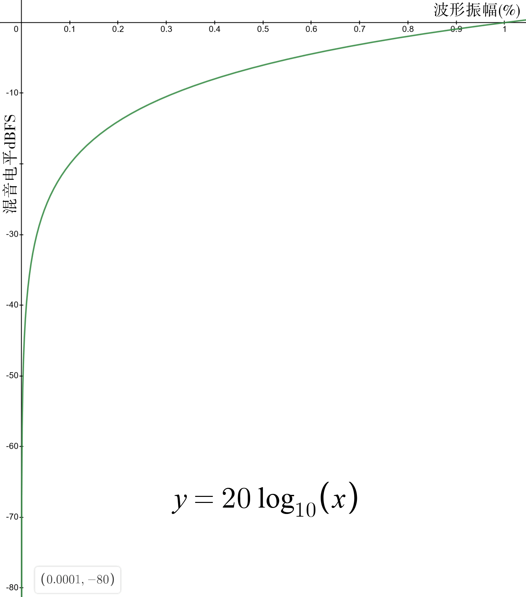

## ❀原创教程，转载请注明链接和作者 
QAAC基于苹果公司的QtAACEnc改进而来的，出现于2012年的开源编码器。相比2006年的NeroAAC更强大，且已经淘汰了MP3格式（因为网络视频几乎都用AAC流）

### 终于有科普板块了hhhhh
- 音频根据用途主要有通话音频，监听音频，HiFi音频~~和噪音~~三种，其中办公音频要求动态音量调节和动态降噪来听清客户说了啥；监听音频要尽可能逼近原声，主要用于混音和反潜；HiFi音频各种DAC和AMP数字电路的信号调校结果，和开MadVR看视频的是同一个群体（但很有钱）
- 音频的位宽bit-width就是数据/视频上说的位深bit-depth，在视频上代表明暗之间的亮度值密度，或者色彩A~B之间色度值的密度；在音频上就是波形音量动态范围的取值密度

### 下载与安装
> 直接下载安装好的[百度云][3]提取码CCCC, 或[谷歌盘][4](v2.7)
1. 下载qaac源码编译结果: [github][1]
2. 下载苹果的Core Audio支持：
- 1. 下载一个iTunes，把后缀改成.zip打开，据系统位数解出AppleApplicationSupport（64）.msi（或直接下载提取自itunes12.3的[AppleApplicationSupport64][5]或[AppleApplicationSupport][6] 
- 2. 下载MSIExtractor(如图是个软件，不是批处理)打开.msi安装包 

- 3. Common Files\\Apple\\Apple Application Support\\目录下，解压出**以下**文件放到QAAC的主目录下(即和qaac64.exe放在一起)，安装就完成啦~

         ASL.dll
         CoreAudioToolbox.dll与CoreFoundation.dll
         icudt*.dll(*代表任何数字或字母)
         libdispatch.dll，libicu*.dll及libicu*.dll(两个不同数字的libicu)
         objc.dll

*没装Visual C++ 2012则还要加上主目录下的mscvp120.dll和mscvr120.dll* 
*要输入flac音频则需要去[github][10]安一个FLAC解码包，或者接受挑战，直接上ffmpeg pipe*

### 打赏信息
在线丢人，求个打赏，支持一下T_T

### 命令行用例
'打开QAAC(文件夹\\qaac.exe)' [参数] '打开音频(路径+文件名+后缀)' 
比如

    'D:\qaac64.exe' -a -b 16 -r 44100 --threading --raw -o '导出位置\导出音频.m4a' '导入位置\*.wav'

> *QAAC默认的导入导出位置就是批处理或shell(.bat/.sh)所在的位置；所以直接用.wav* 
> *然后把批处理/shell拖到同源文件目录下运行就不用写路径了* 
> *导入PCM波形的.wav需要加个--raw，具体见下文导入PCM波形*

### ffmpeg pipe导入
    D:\ffmpeg.exe -i '打开音频' -vn -sn -n -f wav - | D:\qaac.exe [参数 (需确认格式支持)] - --ignorelength

    -o <字符>输出路径与文件名，如有空格则加引号，例如-o 'D:\文件夹\输出音频.aac'
    --ignorelength代表已知输入WAV-PCM文件的情况下，启用unix pipe喂流，省去检查和手打音频长度信息的功夫

### 显示完整编码信息
    --verbose<开关>打开后可以看到平常CLI界面中不显示的东西

### 输出/编码格式
**𝐀𝐀𝐂-𝐋𝐂**：默认的低复杂度low-complexity编码，QAAC中限制最高320kbps，但aac标准上没写这限制 
**𝐀𝐀𝐂-𝐇𝐄**：高压缩效率high-eff.编码，QAAC中限制最高80kbps，同码率下比LC细节好，但码率太低所以很难用到 
**𝐀𝐋𝐀𝐂**： 苹果无损压缩编码的PCM波形文件格式。偏小众，可能不如.ape格式常见

    -V，--tvbr   <挡位0/9/18/27/36/45/54/63/73/82/91/100/109/118/127>可变码率，对应QtAAC的15个挡位，"数字越大音质越好"，默认91，不受--rate参数限制，适合有闲工夫调试着用
    -v，--cvbr   <挡位64/80/96/112/128/144/160/192/224/256/288/320，单位kbps>可变码率，"尽可能"控制在挡位指定的码率中，受--rate参数限制，适合有闲工夫调试着用
    -a, --abr    <整数>平均码率，码率限制下贴合目标码率使用的方案，但同质量下码率不如前两者

> *tvbr, cvbr 模式下，码率有可能会因为源音频流高度复杂而超标，有码率限制的话需要确认没超* 
> *ABR 模式因为用带宽换性能所以只适合直播*

    --he         <开关>用HE-AAC编码，除TVBR和ALAC以外的模式都可用，使用后码率会被锁在16~80kbps. ❀注意是--he而不是-he

### ADTS 流格式

和封装/音频不同，将文件作为真的"流格式"编码，一般用于直播和蓝牙A2DP音频，支持Unix Pipe传给下级处理程序

取决于厂商生态，蓝牙设备还可能支持以下生态编解码中的一部分，高端的外置声卡和音频介面（同时支持蓝牙和USB输入）除外：
- 一定支持：SBC (其实已经满足99%的音质要求)，大部分条形音响都用的这个
- 苹果：AAC-ADTS (QAAC支持编码)
- 高通：aptX，aptX LL，aptX HD，aptX Adaptive
- 索尼：LDAC
- 盛微：LHDC，LLAC，LLAC LL
- 三星（无线IEM耳机）：SSC
- 微软：自购Lucent的Windows LDAC A2DP驱动（25~35 CNY） + 支持蓝牙传输的硬件（USB，PCIE，M.2网卡等）

Windows 10 2004或更高版本可通过[Github上的第三方方案](https://github.com/ysc3839/AudioPlaybackConnector/tree/master)实现蓝牙ADTS输入，
将系统本身临时作为接收设备用，但原作者长期未更新，且仅支持手动连接，有需求的可以（创建Github账户并）fork一个~

### 未压缩流格式

和视频解码器逆运算出画面一样，和音频文件的区别是不需要解码所以（在硬盘快的情况下）打开速度更快，但体积大了很多

### 封装与音频文件格式

相比于纯数据流（视频流，音频流），封装文件增加了如音频封面，视频HDR信息等解码播放器，OS文件系统，串流服务器或用户所需数据的元数据，但体积比音频文件大一点，适合录制CD。音频文件一般叫音频流，因为是和视频封装到一起用的

- **.wav**：未压缩的PCM波形文件后缀（指定`-D`）
- **.alac**：无损压缩PCM波形文件后缀，详见上方ALAC说明（指定`-A`）
- **.aac**：有损压缩的PCM/DTS波形音频流后缀（指定`--adts`）
- **.caf/.m4a**：音频封装，用于打包AAC，ALAC，PCM波形以及歌词，章节，标识，封面等内容到单文件
  - QAAC编码后在MediaInfo打开还会显示"Apple audio with iTunes info"
>

    -D，--decode <开关>输出PCM波形(.wav)
    一般用于频谱分析，毕竟解包不带解码器的软件然后安个解码器进去的门槛超高
    -A，--alac   <开关>无损压缩
    --adts       <开关>以Audio Data Transport System格式编码，主要用于蓝牙耳机和音响. 除无损(ALAC)以外的模式可用
    *留空*       <默认>编码为AAC并封装为.m4a
    --caf        <开关>用core audio format封装格式打包音频流以及-D下导出的PCM波形

> *与ffmpeg/带Lav-filter的视频处理工具不同* 
> *QAAC不识别命令行里导出文件的后缀名，因此必须指定格式参数*

### 导入PCM波形
QAAC会自动检测源的规格，但PCM(.wav)就测不出来，所以会默认用2声道，44100Hz，16bit位深编码新文件. 若与源不符，就要手动指定输入PCM流的规格：

    --raw          <开关>启用纯PCM波形模式，要不然QAAC不知道
    --raw-channels <浮点，默认2>指定声道数量. 有3，4，5，5.1，6，6.1，7，7.1和8可选，要搭配--chanmap用
    --raw-rate     <整数，默认44100>照着源文件写就行啦
    --raw-format   <字符+整数+字符>S/U/F+位深+L/B，若符合默认s16l就不用动咯~

**𝐒(igned)/𝐔(nsigned)**：首个位深字节值里面有（范围0~255）或没有（范围\-128~127）正负号，一般都有，没见过就写默认的S 
**𝐅(loat)**：源音频流是浮点位深，不是整数位深 
**位深**：在音频上都叫位宽，一般是默认16bit，此处不加后缀bits 
**𝐋(ittle-Endian)/𝐁(ig-Endian)**：具体看[这篇教程][11]的解释，总之要用到x86架构的处理器，用默认的L就对啦~

    --ignorelength <开关>已知unix pipe输入WAV-PCM文件流的情况下，启用unix pipe支持，省去检查和手打音频长度信息的功夫

### 多声道编辑
常见的立体声有1左2右两条声道. 而更高的数量的声道会照标准给这些音轨对号入座；比如三声道就是中置1，左2，右3等等，具体见[github][12]里的声道布置表格 
音频的常见问题有麦克拿反/右耳没声音；然后这里PCM波形还无法被QAAC自动检测，所以手打音轨号来修复/指定就成了常规操作...大概

    --chanmask     <浮点，默认0(立体声)>强制使用3，4，5，5.1，6，6.1，7，7.1或8声道
    --chanmap      <逗号分隔数字>重分配输入音频的声道位

> --chanmap 2,1代表音轨1换到二号位，音轨2换到一号位；在立体声中就是左右互换；能修复麦克拿反了的情况，不过据说麦克拿倒了是假唱（大雾） 
> --chanmap 1,1在立体声中将左声道贴入右声道，可以修复右耳没声的问题（未测试） 
> --chanmap 2,3,1代表三声道默认的1中，2左，3右改成2中，3左，1右. 其实就是1移动到了最右边

### 压缩强度与占用

    -b，--bits-per-sample
                  <整数>改动音频位深，比如频谱分析软件支持最深16bit，而音频是24位时就加上-b 16来修复
    -n，--nice    <开关>降低程序优先级
    --threading   <开关>使用多线程
    -q，--quality <整数，范围0~2，默认2> 仅用于编码速度换取音质的参数，不用改
    注: 默认是使用低复杂度low complexity 即lc编码方式，适合直播.
    --no-dither   <开关>关闭抖动，用音质换取文件体积的参数.
    --no-optimize <开关>编码后的音频还要再进行一步优化，以装入.caf/.m4a的封装中，此选项将其关闭，所以别动>_<

### 章节处理

    --chapter      <输出章节>给编码的音频封装(.M4A/.CAF)写入章节信息，至于怎么拷进视频封装里咱就不懂啦❀

    00:00:00.000 Intro
    00:00:31.031 OP
    0:01:57.034 Part_A
    00:12:41.552 Part_B
    00:22:41.151 ED
    00:24:09.740 Next_Ep_Preview

Patlabor TV - 17.txt

    --cue-tracks   <逗号分隔整数>仅支持cue列表的

> --cue-tracks 4就是编码cue文件中指定的第4号音频 
> --cue-tracks 11-13,15就是[分别导出][13]11,12,13,15号音频 
> --concat --cue-tracks 11-13,15就是[组合导出][13]11,12,13,15为一整个音频

    --text-codepage <整数>生成cue sheet/章节/歌词字幕的文本编码，一般用65001表示UTF-8

### 导出章节中单曲
> cue sheet可以自己写，然后保存为.cue 
> 标准格式如下，照着写，然后导入QAAC来分指定cue-tracks导出就行了❀

    REM GENRE Anime
    REM DATE 2014
    REM DISCID 3503D604
    REM COMMENT "ExactAudioCopy v1.0b3"
    CATALOG 4988104079268
    PERFORMER "みかくにんぐッ!"
    TITLE "とまどい→レシピ"
    FILE "みかくにんぐッ! - とまどい→レシピ.wav" WAVE
      TRACK 01 AUDIO
        TITLE "とまどい→レシピ"
        PERFORMER "みかくにんぐッ!"
        ISRC JQ2921400252
        INDEX 01 00:00:00
      TRACK 02 AUDIO
        TITLE "放課後ばけーしょん"
        PERFORMER "みかくにんぐッ!"
        ISRC JQ2921400253
        INDEX 00 04:30:62
        INDEX 01 04:32:36

とまどい→レシピ.cue

### 首位波形缓入缓出
直译的话就是智能首尾垫音，主要设计目的是为了缓冲掉歌曲突然开始，波形从零突然冲顶，低端声卡会直接噼啪爆音(待考证)的情况

    --no-smart-padding
                  <开关>关掉这个默认功能，但不建议

### 音频标识(内容仍然还在施工中)

    --tag         <4cc:value>用fourCC.org标准?格式?的标识(内容正在施工中)
    --tag-from-file <文件名>同上但这次是输入已经写好的文件
    --long-tag    <key:value>用iTunes标准?格式?的标识(内容正在施工中)
    --fname-format<?>文件命名格式(内容正在施工中)
    --fname-from-tag<?>用音频标识命名输出文件，这样给写好的曲子加上tag就可以节省各种导出和压缩的时间了(内容正在施工中)

### 音频编辑

    -r，--rate    <整数>调整音频的采样率，比如视频网站要求44100HZ，而音频是48000HZ就写-r 44100
    --gain        <浮点>调整文件音量，输入负值可减低
    --concat      <开关>将(用通配符如*.wav)输入的多个文件按输入顺序结合为单文件，QAAC会生成章节chapter到.m4a封装里(未验证)
    --normalize   <开关>音量标准化，统一所有要处理歌曲的音量
    --start       <浮点>开始时间，格式hh:mm:ss.xxxxx..... 比如1:13:22.4432就是在1小时13分22.4432秒开始压缩
    --end         <浮点>结束时间，格式同上
    --delay       <浮点>开始前延时，格式同上，如果输入负值则作用同开始时间
    --peak        <开关>扫描音频尖峰并只输出文本，用于方便检查混音音量

### 音频滤镜
用DAW还能预览效果，所以不晓得这个还有啥用...

    --drc         <判定:衰减:缓冲:见效:退效>动态范围压缩，就是将吵的音量压下来，同时保留一定范围内音量，使不该响的不响的功能

    判定    threshold判定(阈值的去术语化叫法), 超过此值则判定为吵，反之未超过的就判定为不吵，单位dBFS，这个值就自己吼一嗓子试试吧(⌒_⌒;)
    衰减    ratio程度，例如判定值是10，比率是3，只要音量超过10db就将<超出的部分>压缩到原来的1/3，通常设15
    缓冲    knee过渡，值越大就越柔和，使整个处理过程更自然的参数，单位db，通常设1
    见效    attack时长，单位毫秒. 防止编码器反应过快，致原本大声没有超过判定值就被压回来 
    ~例如设在3.2，那么超出判定值的音量要从0秒不处理，到花3.2毫秒才完全达到衰减后的设定，通常设25~50左右
    去效    release时长，单位毫秒. 防止编码器反应过快致声降低不明显，在混音中，release越快，对应的乐器轨道就越靠前，反之越慢，因此构成了声场上前-后的声场关系，用于在乐器数量多的情况下保证乐器的主次关系。如果是逼近物理位置还得加上和建筑外形相同反射面建模的自定义Reverb
    ~例如设3.2，那么离开判定范围时，音量会在0秒保持衰减，到3.2毫秒时才完全回到衰减前的设定，通常设150~300左右

举例: '--drc 50:6:7:8.9:10'*指超过50db阈值，压缩到原来的1/6，反应过来前音量低了8.9db，音频落回后花10毫秒将衰减的效果消除*

### 已知报错
`请求的操作无法在使用用户映射区域打开的文件上执行`, 是本应输出并覆盖旧文件时，目标文件被占用导致覆盖失败 
`floating point PCM is not supported for ALAC`，是因为原音频是alac不支持浮点位深，需要-b 16/20/24/32转换~

    --log          <文件名>导出压制log

### 批处理单文件储存多个参数

    ::将此处复制下来保存为.bat文件即可使用
    @ set QAAC=D:\Programs\QAAC\qaac64.exe
    
    @ set 转WAV=-D --threading -r 44100 -b 16
    @ set abr320K=-a 320 -b 16 -r 44100 --threading
    @ set cvbr256K=-v 256 -b 16 -r 44100 --threading
    @ set ALAC=--alac -b 16 --threading
    
    ::使用例子: %QAAC% %转WAV% -o "输出" "输入", 可以多复制调整几行命令以批量处理

### shell单l文件储存多个参数(未验证，需自行修改)
*第一步, 安装Wine以运行.exe:*

    sudo dpkg --add-architecture i386 
    wget -nc https://dl.winehq.org/wine-builds/Release.key
    sudo apt-key add Release.key
    sudo apt-add-repository https://dl.winehq.org/wine-builds/ubuntu/
    sudo apt-get update
    sudo apt-get install --install-recommends winehq-stable
    
*第二步:*

    #将此处复制下来保存为.sh文件, 通过Bash
    #!/bin/Bash
    
    QAAC=./D:\Programs\QAAC\qaac64.exe
    转WAV=-D --threading -r 44100 -b 16
    320K=-a 320 -b 16 -r 44100 --threading
    256K=-a 256 -b 16 -r 44100 --threading
    ALAC=--alac -b 16 --threading

    #使用例子: $QAAC $转WAV -o "输出" "输入", 可以多复制调整几行命令以批量处理

-----

## 关于选择正确的采样率
只要确认要编码音频的音高赫兹数，就可以确定使用更低的采样率编码音频，实现压缩

**采样率**：
 - 一种和视频帧率类似的数据密度，波形的震频，人耳正常听音乐的极限是最高20000~21000Hz或20~21kHz，最低20Hz. 这也有个定理叫奈奎斯特–香农定理
 - 一首歌的采样率是各个声道的采样率加起来的和，比如歌曲44100Hz = 左声道 22050Hz + 右声道 22050Hz
   - 这个计数方法非常的离谱，就比如窗口1播放60fps的视频，窗口2播放60fps的视频，等于120fps的视频一样...

**赫兹**：任何一种测量范围内均衡重复现象，如波形或物件震频，芯片的运行频率，由Hz，KHz，GHz表示，赫兹数越高，支持的音高就越高
 - 歌声中的齿音/咬字音，非元音/通过口腔发出的短音，这些声音仍比乐器的泛音高很多
 - 音高最高的乐器是Hi-Hat/铜嚓，Cymbal/锣

#### QAAC-LC的采样率，声道，码率对应表

| 采样率 (Hz) | 逐轨采样 (Hz) | 声道布置                     | 最小-最大码率流量/CVBR挡位                          |
|-------------|---------------|------------------------------|-----------------------------------------------------|
| 8000        | ==            | Mono                         | 8 12 16 20 24                                       |
| 8000        | 4000          | Stereo                       | 16 20 24 28 32 40 48                                |
| 8000        | 4000          | 3.0 (C L R)                  | 24 28 32 40 48 56 64 72                             |
| 8000        | 4000          | 4.0 (L R Ls Rs)              | 32 40 48 56 64 72 80 96                             |
| 8000        | 4000          | 4.0 (C L R Cs)               | 32 40 48 56 64 72 80 96                             |
| 8000        | 4000          | 5.0 (C L R Ls Rs)            | 40 48 56 64 72 80 96 112                            |
| 8000        | 4000          | 5.1 (C L R Ls Rs LFE)        | 40 48 56 64 72 80 96 112                            |
| 8000        | 4000          | 6.0 (C L R Ls Rs Cs)         | 48 56 64 72 80 96 112 128 144                       |
| 8000        | 4000          | 6.1 (C L R Ls Rs Cs LFE)     | 48 56 64 72 80 96 112 128 144                       |
| 8000        | 4000          | 7.0 (C L R Ls Rs Rls Rrs)    | 56 64 72 80 96 112 128 144 160                      |
| 8000        | 4000          | 7.1 (C Rc L R Ls Rs LFE)     | 56 64 72 80 96 112 128 144 160                      |
| 8000        | 4000          | 8.0 (C L R Ls Rs Rls Rrs Cs) | 64 72 80 96 112 128 144 160 192                     |
| 11025       | ==            | Mono                         | 8 12 16 20 24 28 32                                 |
| 11025       | 5512.5        | Stereo                       | 16 20 24 28 32 40 48 56 64                          |
| 11025       | 5512.5        | 3.0 (C L R)                  | 40 48 56 64 72 80 96                                |
| 11025       | 5512.5        | 4.0 (L R Ls Rs)              | 48 56 64 72 80 96 112 128                           |
| 11025       | 5512.5        | 4.0 (C L R Cs)               | 48 56 64 72 80 96 112 128                           |
| 11025       | 5512.5        | 5.0 (C L R Ls Rs)            | 64 72 80 96 112 128 144 160                         |
| 11025       | 5512.5        | 5.1 (C L R Ls Rs LFE)        | 64 72 80 96 112 128 144 160                         |
| 11025       | 5512.5        | 6.0 (C L R Ls Rs Cs)         | 72 80 96 112 128 144 160 192                        |
| 11025       | 5512.5        | 6.1 (C L R Ls Rs Cs LFE)     | 72 80 96 112 128 144 160 192                        |
| 11025       | 5512.5        | 7.0 (C L R Ls Rs Rls Rrs)    | 96 112 128 144 160 192 224                          |
| 11025       | 5512.5        | 7.1 (C Rc L R Ls Rs LFE)     | 96 112 128 144 160 192 224                          |
| 11025       | 5512.5        | 8.0 (C L R Ls Rs Rls Rrs Cs) | 96 112 128 144 160 192 224 256                      |
| 12000       | ==            | Mono                         | 12 16 20 24 28 32                                   |
| 12000       | 6000          | Stereo                       | 24 28 32 40 48 56 64                                |
| 12000       | 6000          | 3.0 (C L R)                  | 40 48 56 64 72 80 96                                |
| 12000       | 6000          | 4.0 (L R Ls Rs)              | 48 56 64 72 80 96 112 128                           |
| 12000       | 6000          | 4.0 (C L R Cs)               | 48 56 64 72 80 96 112 128                           |
| 12000       | 6000          | 5.0 (C L R Ls Rs)            | 64 72 80 96 112 128 144 160                         |
| 12000       | 6000          | 5.1 (C L R Ls Rs LFE)        | 64 72 80 96 112 128 144 160                         |
| 12000       | 6000          | 6.0 (C L R Ls Rs Cs)         | 72 80 96 112 128 144 160 192                        |
| 12000       | 6000          | 6.1 (C L R Ls Rs Cs LFE)     | 72 80 96 112 128 144 160 192                        |
| 12000       | 6000          | 7.0 (C L R Ls Rs Rls Rrs)    | 96 112 128 144 160 192 224                          |
| 12000       | 6000          | 7.1 (C Rc L R Ls Rs LFE)     | 96 112 128 144 160 192 224                          |
| 12000       | 6000          | 8.0 (C L R Ls Rs Rls Rrs Cs) | 96 112 128 144 160 192 224 256                      |
| 16000       | ==            | Mono                         | 12 16 20 24 28 32 40 48                             |
| 16000       | 8000          | Stereo                       | 24 28 32 40 48 56 64 72 80 96                       |
| 16000       | 8000          | 3.0 (C L R)                  | 40 48 56 64 72 80 96 112 128 144                    |
| 16000       | 8000          | 4.0 (L R Ls Rs)              | 48 56 64 72 80 96 112 128 144 160 192               |
| 16000       | 8000          | 4.0 (C L R Cs)               | 48 56 64 72 80 96 112 128 144 160 192               |
| 16000       | 8000          | 5.0 (C L R Ls Rs)            | 64 72 80 96 112 128 144 160 192 224                 |
| 16000       | 8000          | 5.1 (C L R Ls Rs LFE)        | 64 72 80 96 112 128 144 160 192 224                 |
| 16000       | 8000          | 6.0 (C L R Ls Rs Cs)         | 72 80 96 112 128 144 160 192 224 256 288            |
| 16000       | 8000          | 6.1 (C L R Ls Rs Cs LFE)     | 72 80 96 112 128 144 160 192 224 256 288            |
| 16000       | 8000          | 7.0 (C L R Ls Rs Rls Rrs)    | 96 112 128 144 160 192 224 256 288 320              |
| 16000       | 8000          | 7.1 (C Rc L R Ls Rs LFE)     | 96 112 128 144 160 192 224 256 288 320              |
| 16000       | 8000          | 8.0 (C L R Ls Rs Rls Rrs Cs) | 96 112 128 144 160 192 224 256 288 320 384          |
| 22050       | ==            | Mono                         | 16 20 24 28 32 40 48 56 64                          |
| 22050       | 11025         | Stereo                       | 32 40 48 56 64 72 80 96 112 128                     |
| 22050       | 11025         | 3.0 (C L R)                  | 48 56 64 72 80 96 112 128 144 160 192               |
| 22050       | 11025         | 4.0 (L R Ls Rs)              | 64 72 80 96 112 128 144 160 192 224 256             |
| 22050       | 11025         | 4.0 (C L R Cs)               | 64 72 80 96 112 128 144 160 192 224 256             |
| 22050       | 11025         | 5.0 (C L R Ls Rs)            | 80 96 112 128 144 160 192 224 256 288 320           |
| 22050       | 11025         | 5.1 (C L R Ls Rs LFE)        | 80 96 112 128 144 160 192 224 256 288 320           |
| 22050       | 11025         | 6.0 (C L R Ls Rs Cs)         | 96 112 128 144 160 192 224 256 288 320 384          |
| 22050       | 11025         | 6.1 (C L R Ls Rs Cs LFE)     | 96 112 128 144 160 192 224 256 288 320 384          |
| 22050       | 11025         | 7.0 (C L R Ls Rs Rls Rrs)    | 112 128 144 160 192 224 256 288 320 384 448         |
| 22050       | 11025         | 7.1 (C Rc L R Ls Rs LFE)     | 112 128 144 160 192 224 256 288 320 384 448         |
| 22050       | 11025         | 8.0 (C L R Ls Rs Rls Rrs Cs) | 128 144 160 192 224 256 288 320 384 448 512         |
| 24000       | ==            | Mono                         | 16 20 24 28 32 40 48 56 64                          |
| 24000       | 12000         | Stereo                       | 32 40 48 56 64 72 80 96 112 128                     |
| 24000       | 12000         | 3.0 (C L R)                  | 48 56 64 72 80 96 112 128 144 160 192               |
| 24000       | 12000         | 4.0 (L R Ls Rs)              | 64 72 80 96 112 128 144 160 192 224 256             |
| 24000       | 12000         | 4.0 (C L R Cs)               | 64 72 80 96 112 128 144 160 192 224 256             |
| 24000       | 12000         | 5.0 (C L R Ls Rs)            | 80 96 112 128 144 160 192 224 256 288 320           |
| 24000       | 12000         | 5.1 (C L R Ls Rs LFE)        | 80 96 112 128 144 160 192 224 256 288 320           |
| 24000       | 12000         | 6.0 (C L R Ls Rs Cs)         | 96 112 128 144 160 192 224 256 288 320 384          |
| 24000       | 12000         | 6.1 (C L R Ls Rs Cs LFE)     | 96 112 128 144 160 192 224 256 288 320 384          |
| 24000       | 12000         | 7.0 (C L R Ls Rs Rls Rrs)    | 112 128 144 160 192 224 256 288 320 384 448         |
| 24000       | 12000         | 7.1 (C Rc L R Ls Rs LFE)     | 112 128 144 160 192 224 256 288 320 384 448         |
| 24000       | 12000         | 8.0 (C L R Ls Rs Rls Rrs Cs) | 128 144 160 192 224 256 288 320 384 448 512         |
| 32000       | ==            | Mono                         | 24 28 32 40 48 56 64 72 80 96                       |
| 32000       | 16000         | Stereo                       | 48 56 64 72 80 96 112 128 144 160 192               |
| 32000       | 16000         | 3.0 (C L R)                  | 72 80 96 112 128 144 160 192 224 256 288            |
| 32000       | 16000         | 4.0 (L R Ls Rs)              | 96 112 128 144 160 192 224 256 288 320 384          |
| 32000       | 16000         | 4.0 (C L R Cs)               | 96 112 128 144 160 192 224 256 288 320 384          |
| 32000       | 16000         | 5.0 (C L R Ls Rs)            | 128 144 160 192 224 256 288 320 384 448             |
| 32000       | 16000         | 5.1 (C L R Ls Rs LFE)        | 128 144 160 192 224 256 288 320 384 448             |
| 32000       | 16000         | 6.0 (C L R Ls Rs Cs)         | 144 160 192 224 256 288 320 384 448 512 576         |
| 32000       | 16000         | 6.1 (C L R Ls Rs Cs LFE)     | 144 160 192 224 256 288 320 384 448 512 576         |
| 32000       | 16000         | 7.0 (C L R Ls Rs Rls Rrs)    | 192 224 256 288 320 384 448 512 576 640             |
| 32000       | 16000         | 7.1 (C Rc L R Ls Rs LFE)     | 192 224 256 288 320 384 448 512 576 640             |
| 32000       | 16000         | 8.0 (C L R Ls Rs Rls Rrs Cs) | 192 224 256 288 320 384 448 512 576 640 768         |
| 44100       | ==            | Mono                         | 32 40 48 56 64 72 80 96 112 128 144 160 192 224 256 |
| 44100       | 22050         | Stereo                       | 64 72 80 96 112 128 144 160 192 224 256 288 320     |
| 44100       | 22050         | 3.0 (C L R)                  | 96 112 128 144 160 192 224 256 288 320 384 448      |
| 44100       | 22050         | 4.0 (L R Ls Rs)              | 128 144 160 192 224 256 288 320 384 448 512 576 640 |
| 44100       | 22050         | 4.0 (C L R Cs)               | 128 144 160 192 224 256 288 320 384 448 512 576 640 |
| 44100       | 22050         | 5.0 (C L R Ls Rs)            | 160 192 224 256 288 320 384 448 512 576 640 768     |
| 44100       | 22050         | 5.1 (C L R Ls Rs LFE)        | 160 192 224 256 288 320 384 448 512 576 640 768     |
| 44100       | 22050         | 6.0 (C L R Ls Rs Cs)         | 192 224 256 288 320 384 448 512 576 640 768 960     |
| 44100       | 22050         | 6.1 (C L R Ls Rs Cs LFE)     | 192 224 256 288 320 384 448 512 576 640 768 960     |
| 44100       | 22050         | 7.0 (C L R Ls Rs Rls Rrs)    | 224 256 288 320 384 448 512 576 640 768 960         |
| 44100       | 22050         | 7.1 (C Rc L R Ls Rs LFE)     | 224 256 288 320 384 448 512 576 640 768 960         |
| 44100       | 22050         | 8.0 (C L R Ls Rs Rls Rrs Cs) | 256 288 320 384 448 512 576 640 768 960 1280        |
| 48000       | ==            | Mono                         | 32 40 48 56 64 72 80 96 112 128 144 160 192 224 256 |
| 48000       | 24000         | Stereo                       | 64 72 80 96 112 128 144 160 192 224 256 288 320     |
| 48000       | 24000         | 3.0 (C L R)                  | 96 112 128 144 160 192 224 256 288 320 384 448      |
| 48000       | 24000         | 4.0 (L R Ls Rs)              | 128 144 160 192 224 256 288 320 384 448 512 576 640 |
| 48000       | 24000         | 4.0 (C L R Cs)               | 128 144 160 192 224 256 288 320 384 448 512 576 640 |
| 48000       | 24000         | 5.0 (C L R Ls Rs)            | 160 192 224 256 288 320 384 448 512 576 640 768     |
| 48000       | 24000         | 5.1 (C L R Ls Rs LFE)        | 160 192 224 256 288 320 384 448 512 576 640 768     |
| 48000       | 24000         | 6.0 (C L R Ls Rs Cs)         | 192 224 256 288 320 384 448 512 576 640 768 960     |
| 48000       | 24000         | 6.1 (C L R Ls Rs Cs LFE)     | 192 224 256 288 320 384 448 512 576 640 768 960     |
| 48000       | 24000         | 7.0 (C L R Ls Rs Rls Rrs)    | 224 256 288 320 384 448 512 576 640 768 960         |
| 48000       | 24000         | 7.1 (C Rc L R Ls Rs LFE)     | 224 256 288 320 384 448 512 576 640 768 960         |
| 48000       | 24000         | 8.0 (C L R Ls Rs Rls Rrs Cs) | 256 288 320 384 448 512 576 640 768 960 1280        |

#### QAAC-HE的采样率，声道，码率对应表

| 采样率 (Hz) | 逐轨采样 (Hz)   | 声道布置                 | 最小-最大码率流量/CVBR挡位           |
|-------------|-----------------|--------------------------|--------------------------------------|
| 16000       | ==              | Mono                     | 10 12 16 20 24 28 32                 |
| 16000       | 8000            | Stereo                   | 20 24 28 32 40 48 56 64              |
| 16000       | 8000            | 4.0 (L R Ls Rs)          | 40 48 56 64 80 96 112 128            |
| 16000       | 8000            | 5.1 (C L R Ls Rs LFE)    | 56 64 80 96 112 128 160              |
| 16000       | 8000            | 7.1 (C Rc L R Ls Rs LFE) | 80 96 112 128 160 192 224            |
| 22050       | ==              | Mono                     | 10 12 16 20 24 28 32                 |
| 22050       | 11025           | Stereo                   | 20 24 28 32 40 48 56 64              |
| 22050       | 11025           | 4.0 (L R Ls Rs)          | 40 48 56 64 80 96 112 128            |
| 22050       | 11025           | 5.1 (C L R Ls Rs LFE)    | 56 64 80 96 112 128 160              |
| 22050       | 11025           | 7.1 (C Rc L R Ls Rs LFE) | 80 96 112 128 160 192 224            |
| 24000       | ==              | Mono                     | 12 16 20 24 28 32                    |
| 24000       | 12000           | Stereo                   | 24 28 32 40 48 56 64                 |
| 24000       | 12000           | 4.0 (L R Ls Rs)          | 48 56 64 80 96 112 128               |
| 24000       | 12000           | 5.1 (C L R Ls Rs LFE)    | 64 80 96 112 128 160                 |
| 24000       | 12000           | 7.1 (C Rc L R Ls Rs LFE) | 96 112 128 160 192 224               |
| 32000       | ==              | Mono                     | 12 16 20 24 28 32 40                 |
| 32000       | 16000           | Stereo                   | 24 28 32 40 48 56 64 80              |
| 32000       | 16000           | 4.0 (L R Ls Rs)          | 48 56 64 80 96 112 128 160           |
| 32000       | 16000           | 5.1 (C L R Ls Rs LFE)    | 64 80 96 112 128 160 192             |
| 32000       | 16000           | 7.1 (C Rc L R Ls Rs LFE) | 96 112 128 160 192 224 256           |
| 44100       | ==              | Mono                     | 16 20 24 28 32 40                    |
| 44100       | 22050           | Stereo                   | 32 40 48 56 64 80                    |
| 44100       | 22050           | 4.0 (L R Ls Rs)          | 64 80 96 112 128 160                 |
| 44100       | 22050           | 5.1 (C L R Ls Rs LFE)    | 80 96 112 128 160 192                |
| 44100       | 22050           | 7.1 (C Rc L R Ls Rs LFE) | 112 128 160 192 224 256              |
| 48000       | ==              | Mono                     | 16 20 24 28 32 40                    |
| 48000       | 24000           | Stereo                   | 32 40 48 56 64 80                    |
| 48000       | 24000           | 4.0 (L R Ls Rs)          | 64 80 96 112 128 160                 |
| 48000       | 24000           | 5.1 (C L R Ls Rs LFE)    | 80 96 112 128 160 192                |
| 48000       | 24000           | 7.1 (C Rc L R Ls Rs LFE) | 112 128 160 192 224 256              |
| 88200       | ==              | Mono                     | 32 40 48 56 64 80 96 112 128 160     |
| 88200       | 44100           | Stereo                   | 64 80 96 112 128 160 192 224 256 320 |
| 88200       | 44100           | 4.0 (L R Ls Rs)          | 128 160 192 224 256 320 448 640      |
| 88200       | 44100           | 5.1 (C L R Ls Rs LFE)    | 160 192 224 256 320 448 640          |
| 88200       | 44100           | 7.1 (C Rc L R Ls Rs LFE) | 224 256 320 448 640 1120             |
| 96000       | ==              | Mono                     | 32 40 48 56 64 80 96 112 128 160     |
| 96000       | 48000           | Stereo                   | 64 80 96 112 128 160 192 224 256 320 |
| 96000       | 48000           | 4.0 (L R Ls Rs)          | 128 160 192 224 256 320 448 640      |
| 96000       | 48000           | 5.1 (C L R Ls Rs LFE)    | 160 192 224 256 320 448 640          |
| 96000       | 48000           | 7.1 (C Rc L R Ls Rs LFE) | 224 256 320 448 640 1120             |

#### 操作

 1. 打开Audition或其它可以观察频谱/热度图的软件
 2. 导入源音频，找到全曲响度最大，最激烈的部分（一般为副歌Chorus）
 3. 对频谱/热度图操作`Ctrl+鼠标滚轮向下`直到能看见22kHz的信号频率为止

   - 图中例子显示，在19kHz的信号频率往上就没有任何有效信息了
   - 如果怀疑信号有效，则可以用鼠标左键拖选这部分信号并播放，如果听不到就调大音量，直到听到为止（注意保护听力，因为同时也会提高本来就很响频段的音量）

 5. 可以打开`窗口 > 频率分析`以仔细观察频谱，进度条指针所对应18kHz及其上方的信号电平小于-80dBFS

- 根据波形振幅转换混音电平的公式可以看到，在-50dBFS以下的波形振幅太小了，对音质/信号完整性没有任何贡献（甚至从-60dBFS开始就失效了）

- -50dBFS以下电平需要正常歌曲音量播放在75~85dB（标准混音音量）的时候能勉强听到一点，-60dBFS以下的电平需要让正常歌曲能打碎玻璃的音量才能听到，-80dBFS以下的电平...理论上需要能让正常歌曲弄坏扬声器的巨大音量才能听到

因此，根据对音频的频谱分析，得到了*仅限这段音频中*大于19kHz的音高属于可以砍掉无效信号的结论；对应到AAC-LC双声道逐轨最高有效为22050Hz，即全音频流44100Hz的最高有效采样率，得到参数

    qaac64.exe --tvbr 127 -b 16 -r 44100 --threading --verbose

甚至可以更进一步地把所有-60dBFS（12kHz以上的频段），但适用的音频更少；对应到AAC-LC双声道逐轨最高有效为16000Hz，即全音频流32000Hz的最高有效采样率，得到参数

    qaac64.exe --tvbr 127 -b 16 -r 32000 --threading --verbose

最终得到了平均300Kbps，但音质与44100Hz或更高储存频率的音频差▲1‰左右，同时理论音质等于或高于CVBR 320kbps，44100或48000Hz的高压缩音轨
- 有概率变高是因为更多码率能被拿来编码有效信号

### 理论验证
为防被说瞎搞，所以验证了一下理论... 方法是将-6dBFS的电平对应到90~100dB，然后逐渐降低音量从而获取到-80dBFS的感知音量，缺陷是录音设备是一加3T和一加8，一加3T的最大收音音量只有64dB，一加8的最大收音音量只有89dB
 - 播放一个-6dBFS的正弦波，实际音量为大于89dB（要被震吐了...）

 - 然后把电平降低到-38dBFS，接收音量下降到了48dB，此时体感音量相当于手机音量设置在8~18%

 - 然后把电平降低到-48dBFS，接收音量下降到了22dB，这个时候扬声器的音量低于环境噪音(19~25dB)，耳朵贴在扬声器上能勉强听到

 - 再往下就完全被环境噪音遮住了，但在-52~-54dBFS的时候把耳朵贴在扬声器上使劲听还是能听到很微弱的一点点...

那么... emmmmmmm就这样，呕

- 2024.1更新：改良了封装文件vs音频文件格式，并增加了QAAC不根据后缀名判断的说明（感谢@1-β²）

  [1]: http://github.com/nu774/qaac/releases
  [2]: http://www.ecit.org.cn:8088/topics/163
  [3]: https://pan.baidu.com/s/1YwsxMDDn1tt76FaWAImEoQ
  [4]: https://drive.google.com/file/d/1dEJpnTmiRyCVBZyVd-kgV75c5iI8GOZ_/view?usp=sharing
  [5]: https://github.com/kiki-kiko/iTunes-12.3.1.23/raw/master/AppleApplicationSupport64.msi
  [6]: https://github.com/kiki-kiko/iTunes-12.3.1.23/raw/master/AppleApplicationSupport.msi

  [10]: https://github..com/nu774/qaac/wiki/Installation
  [11]: https://www.nazorip.site/archives/267/
  [12]: https://github.com/nu774/qaac/wiki/Multichannel--handling
  [13]: https://github.com/nu774/qaac/wiki/About-input-format
  [14]: https://github.com/audiojs/sample-rate
